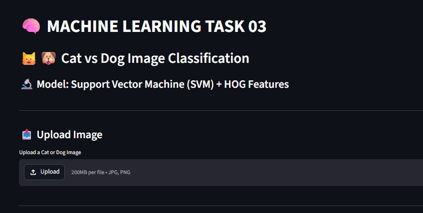
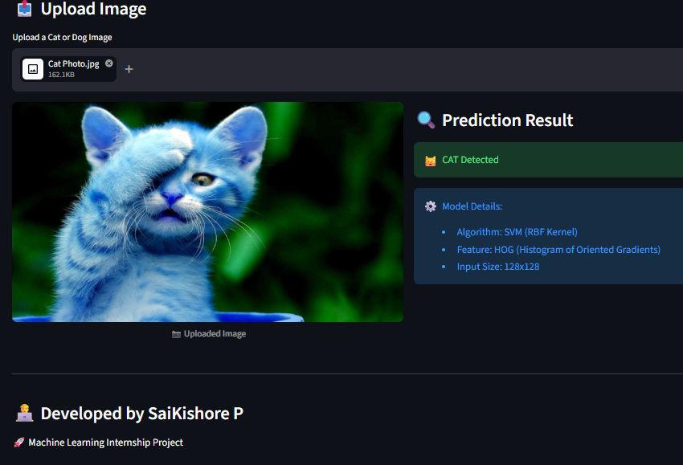

# 🧠 Machine Learning Task 03  
## 🐱🐶 Cat vs Dog Image Classification using SVM

This project is part of the **Machine Learning Internship**.  
It implements a **Support Vector Machine (SVM)** model with **HOG feature extraction** to classify images of cats and dogs.

---

## 🚀 Live Demo  
👉 https://cat-dog-svm-classifier.streamlit.app/

---

## 📸 Project Screenshots

### 🖥️ Application UI

### 🔍 Prediction Output

---

## 🧠 Model Details

- **Algorithm:** Support Vector Machine (SVM)  
- **Kernel:** RBF  
- **Feature Extraction:** HOG (Histogram of Oriented Gradients)  
- **Image Size:** 128x128  
- **Task Type:** Binary Classification  

---

